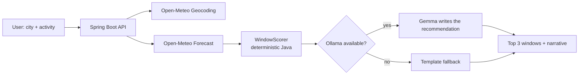

# 🌿 Janela

**Find your window to touch grass.**

Janela (Portuguese for *window*) finds the best time windows in the next few days for an outdoor activity —
running, walking, cycling, a picnic, some gardening — based on what actually matters in a tropical climate:
heat, UV index, afternoon storms and wind.

Then a **local open-weight model (Gemma, via Ollama)** turns those numbers into a short, human recommendation
and a tiny "touch grass" challenge. No API keys, no per-query costs, and it still works if the model is offline.

> 🚧 Work in progress — built for the [Hacktoberfest 2026 Open-Source AI Challenge: Week 1 — "Touch Grass"](https://dev.to/challenges/hacktoberfest-week1-2026-10-05) (Oct 5–11, 2026).

## Why

In much of Brazil, "go for a run" isn't about frost. It's about dodging a UV index of 11 at noon
and the thunderstorm that shows up at 5 PM. Weather apps give you the data; Janela tells you *when to go*.

## How it works



**Java computes, Gemma explains.** The scoring is plain, unit-tested Java. The model never picks times
or does math — it only receives the ranked windows and writes about them, so it can't hallucinate the forecast.

## Stack

- **Backend:** Java 21, Spring Boot 4, Spring AI 2.0 (Ollama starter)
- **Model:** Gemma (`gemma3:4b` by default) running locally with [Ollama](https://ollama.com)
- **Weather:** [Open-Meteo](https://open-meteo.com) forecast and geocoding APIs (open data, no key)
- **Frontend:** React, TypeScript, TanStack Query, Tailwind CSS, shadcn/ui

## Running locally

> Full instructions coming as the project takes shape.

```bash
# 1. Pull the model
ollama pull gemma3:4b

# 2. Start the backend
cd backend && ./mvnw spring-boot:run

# 3. Start the frontend
cd frontend && pnpm install && pnpm dev
```

## Credits

- Weather data by [Open-Meteo](https://open-meteo.com) (CC BY 4.0)
- [Gemma](https://ai.google.dev/gemma) open-weight models by Google
- [Spring AI](https://spring.io/projects/spring-ai) and [Ollama](https://ollama.com)

## License

[MIT](LICENSE)
