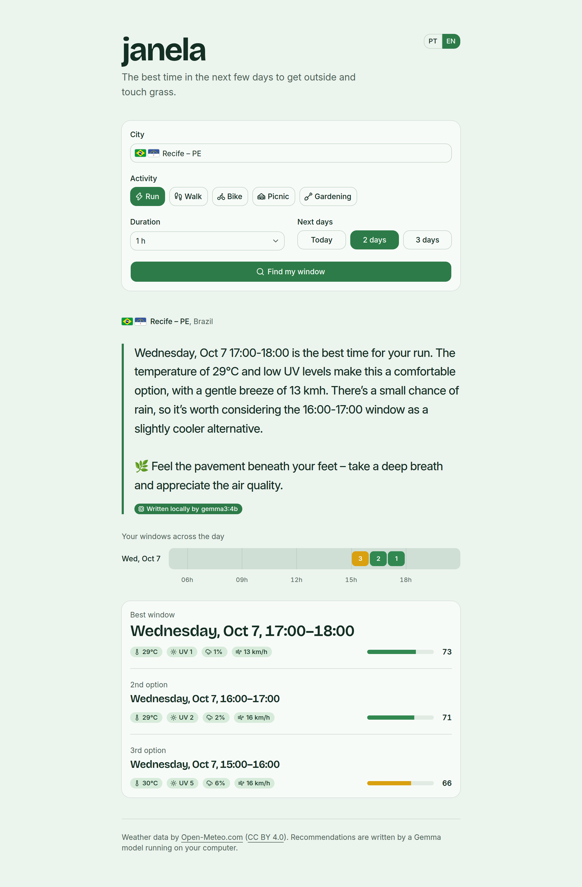
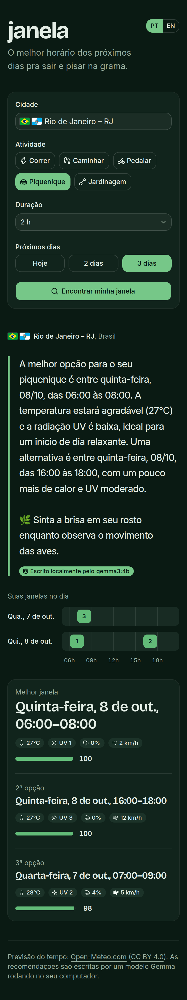
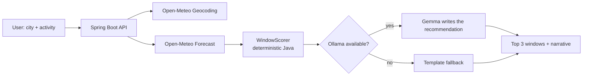

# 🌿 Janela

**Find your window to touch grass.**

Janela (Portuguese for *window*) finds the best time windows in the next few days for an outdoor activity —
running, walking, cycling, a picnic, some gardening — based on what actually matters in a tropical climate:
heat, UV index, afternoon storms and wind.

Then a **local open-weight model (Gemma, via Ollama)** turns those numbers into a short, human recommendation
and a tiny "touch grass" challenge. No API keys, no per-query costs, and it still works if the model is offline.

Built for the [Hacktoberfest 2026 Open-Source AI Challenge: Week 1 — "Touch Grass"](https://dev.to/challenges/hacktoberfest-week1-2026-10-05).

<p align="center">
  
  &nbsp;
  
</p>

## Why

In much of Brazil, "go for a run" isn't about frost. It's about dodging a UV index of 11 at noon
and the thunderstorm that shows up at 5 PM. Weather apps give you the data; Janela tells you *when to go*.

## How it works



**Java computes, Gemma explains.** Small models get arithmetic wrong and invent numbers with confidence,
so the scoring is plain, unit-tested Java. The model never picks times or does math — it receives the
ranked windows and only writes about them, so it can't hallucinate the forecast.

The payload is pre-digested so a 4B model copies instead of interpreting: day names and times are already
formatted in the target language, values are rounded the way the UI shows them, and UV comes with its
WHO category (`low` … `extreme`). If Ollama is down or slow, a template writes the text instead and the
UI labels it as such.

### Scoring

Every daytime hour starts at 100 and loses points for rain chance, feels-like temperature outside the
activity's range, and UV or wind above its limits. A window is the best run of consecutive daytime hours
covering the requested duration; any hour below 40 rules the whole window out. The top 3 non-overlapping
windows are returned.

| Activity  | Feels-like range | Max comfortable UV | Max wind |
|-----------|------------------|--------------------|----------|
| Run       | 10–22 °C         | 5                  | 30 km/h  |
| Walk      | 14–26 °C         | 6                  | 35 km/h  |
| Bike      | 12–24 °C         | 6                  | 22 km/h  |
| Picnic    | 18–28 °C         | 4                  | 20 km/h  |
| Gardening | 15–27 °C         | 5                  | 30 km/h  |

## Running locally

**Prerequisites:** Java 21, Node.js 20.19+ (or 22.12+), [pnpm](https://pnpm.io) (`corepack enable pnpm` works),
and [Ollama](https://ollama.com).

```bash
# 1. Pull the model (Ollama must be running)
ollama pull gemma3:4b

# 2. Start the backend on http://localhost:8080
cd backend && ./mvnw spring-boot:run

# 3. In another terminal, start the frontend on http://localhost:5173
cd frontend && pnpm install && pnpm dev
```

Open http://localhost:5173. The first answer takes about 15 seconds while Gemma writes; without Ollama
you get the template text in a few seconds.

Type a city and pick a suggestion — "Itobi – SP", with the country and state flags — so a name shared by
several places resolves to the right one. Searches are shareable:
`http://localhost:5173/?city=Recife&activity=run&duration=60&days=2&lang=en` runs the search as soon as the page opens.

### Configuration

| Variable          | Default                  | What it does                                        |
|-------------------|--------------------------|-----------------------------------------------------|
| `OLLAMA_BASE_URL` | `http://localhost:11434` | Where Ollama is listening                            |
| `OLLAMA_MODEL`    | `gemma3:4b`              | Any Ollama chat model, e.g. `gemma3:12b`             |
| `OLLAMA_TIMEOUT`  | `30s`                    | How long to wait for the model before the template  |
| `VITE_API_URL`    | `http://localhost:8080`  | Backend URL used by the frontend                     |

The backend only accepts browser requests from `http://localhost:5173`
(`janela.cors.allowed-origins` in `backend/src/main/resources/application.yaml`).

> **WSL2 + Ollama on Windows:** with `networkingMode=mirrored`, `localhost` just works. Otherwise copy
> `application-local.example.yaml` to `application-local.yaml` and point `base-url` at the Windows host IP,
> then run `./mvnw spring-boot:run -Dspring-boot.run.profiles=local`.

### Tests

```bash
cd backend && ./mvnw test          # scorer, use case, Open-Meteo clients, Gemma payload, controller
cd frontend && pnpm test && pnpm lint && pnpm build
```

## API

Interactive docs at http://localhost:8080/swagger-ui.html while the backend runs; the OpenAPI 3.1 document
is generated from the code at `/v3/api-docs` and exported to [`docs/openapi.yaml`](docs/openapi.yaml).

Routes are versioned in the path (`/api/v1/...`) with Spring Framework 7's native API versioning; an
unsupported version answers `400` with a problem detail.

`GET /api/v1/cities?q=Itobi&lang=pt` suggests up to 6 places while you type, each with its state (`admin1`),
country and an `id`:

```json
[{ "id": 3460543, "name": "Itobi", "admin1": "São Paulo", "country": "Brasil", "countryCode": "BR",
   "latitude": -21.73694, "longitude": -46.975 }]
```

`GET /api/v1/windows`

| Parameter         | Required | Values                                      |
|-------------------|----------|---------------------------------------------|
| `city`            | yes      | City name, e.g. `Recife`                    |
| `cityId`          | no       | An `id` from `/api/v1/cities`; pins that exact place instead of the name's best match |
| `activity`        | yes      | `RUN`, `WALK`, `BIKE`, `PICNIC`, `GARDENING` |
| `durationMinutes` | yes      | 15–480 (rounded up to whole hours)          |
| `days`            | no       | 1–3, default 1                              |
| `lang`            | no       | `pt` or `en`, default `pt`                  |

```bash
curl "http://localhost:8080/api/v1/windows?city=Recife&activity=RUN&durationMinutes=60&days=2&lang=en"
```

```json
{
  "location": { "id": 3390760, "name": "Recife", "admin1": "Pernambuco", "country": "Brasil", "countryCode": "BR",
                "latitude": -8.05389, "longitude": -34.88111, "timezone": "America/Recife" },
  "activity": "RUN",
  "windows": [
    { "start": "2026-10-07T17:00", "end": "2026-10-07T18:00", "score": 75,
      "apparentTempC": 28.2, "maxUv": 0.6, "maxRainProbability": 1, "maxWindKmh": 14.5 }
  ],
  "narrative": "The best window for your run is Wednesday, Oct 7 from 17:00 to 18:00. …\n🌿 Feel the breeze on your face…",
  "aiGenerated": true,
  "model": "gemma3:4b"
}
```

Times are local to the city and `end` is exclusive. Errors, including Spring's own (unknown route, wrong method), use RFC 9457 problem details:
`404` for an unknown city, `400` with a `fields` list for invalid parameters, `503` when the forecast is unavailable.

## Why open models

- **Runs on your laptop.** No API key, no per-query cost, no account.
- **Your plans stay with you.** Where you are and when you go out never reach an AI cloud.
  (To be honest about it: the forecast itself comes from Open-Meteo's open API, so that request does leave your machine.)
- **Swappable.** Change `OLLAMA_MODEL` to try another open-weight model.
- **Works without AI.** If the model is off, you still get the windows and a template text.

## Project layout

```
backend/    Spring Boot API — domain (scorer, model), use case, Open-Meteo clients, Gemma + template narrators
frontend/   React + Vite single page — search form, Gemma narrative, day strip, ranked windows
docs/       Screenshots
```

## Stack

- **Backend:** Java 21, Spring Boot 4, Spring AI 2.0 (Ollama starter)
- **Model:** Gemma (`gemma3:4b` by default) running locally with [Ollama](https://ollama.com)
- **Weather:** [Open-Meteo](https://open-meteo.com) forecast and geocoding APIs (open data, no key)
- **Frontend:** React 19, TypeScript, Vite, TanStack Query, Tailwind CSS 4, shadcn/ui (Base UI)

## Credits

- Weather data by [Open-Meteo](https://open-meteo.com) (CC BY 4.0)
- [Gemma](https://ai.google.dev/gemma) open-weight models by Google
- [Spring AI](https://spring.io/projects/spring-ai) and [Ollama](https://ollama.com)
- Typefaces: [Inter](https://rsms.me/inter/) and [Bricolage Grotesque](https://fonts.google.com/specimen/Bricolage+Grotesque)
- Country flags: [country-flag-icons](https://gitlab.com/catamphetamine/country-flag-icons) (MIT);
  Brazilian state flags: [Wikimedia Commons](https://commons.wikimedia.org) (public domain)

## License

[MIT](LICENSE)
